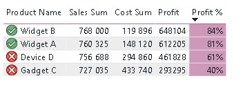
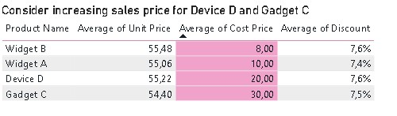

Siin on andmetarkuse kursuse materjalid.

# Sales Report
You can find the Power Bi file for Sales Report: https://github.com/siiriliis/andmetarkus2026/blob/main/SalesReport/SalesReport.pbix
This file can be opened in Power BI Desktop
Next, the analysisi steps are explained

## Overiview of Company
This is an example dataset created by OpenAI

## Data Cleaning
The original table was "SalesTable.csv" which was controlled for data quality through PowerQuery
I checked for format issues and outliers

Fixes made:

Data quality issues identified and corrections made based on sales representative input as of 31.03.2026  
1. Customer ID: C005 should be C004; updated in the cleaned file.  

2. ProductID: P005 and P006 should be P004; updated in the cleaned file.  

3. Incorrect Quantity on sales line S00009: was 300, changed to 3 in the cleaned file.  

4. Incorrect Unit Price on sales line S00010: was 2000, changed to 20 in the cleaned file.  

## Analysis
I created pages for YTD Sales, Sales vs Budget and Profitability views by Product, Sales Representative and Region.
During the analysis, I noticed that two products: Device D and Gadget C have lower profitability than other products:

I created pages for YTD Sales, Sales vs Budget and Profitability views by Product, Sales Representative and Region.
During the analysis, I noticed that two products: Device D and Gadget C have lower profitability than other products:

## Recommendations
Based on the analysis, it is recommended to look over the pricing model as products that have an higher cost of producing are being sold at the same price as products with a lower cost of producing.

# Employee Report

## Problem Statement
HR department wants an overview of active and left employees over time and results of satisfaction survey

## Plan
I will create a Power BI report to give this overview.  

## Data 
HR department gave me two files:  
- "Employee_Satisfaction_Survey.xlsx"  
- "HR_Dataset.CSV"

 ### Data Cleaning 
 I checked data for uniquensess, formats and outliers through PowerQuery
 Survey dataset didn't have a unique key column. I created a new column "AnsverKey" which combined "Question Round" and "Answer ID"
 In HR dataset, I removed columns with personal data: "First Name", "Last Name" and "Email". Also removed the column "Employment Status" as the data in that column was not up to date according to the HR department.
 Column "Salary" was changed to Decimal Number format

## Analysis

## Recommendations
